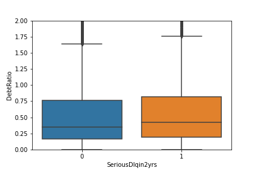
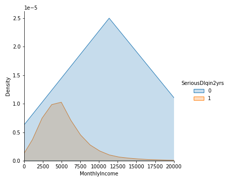
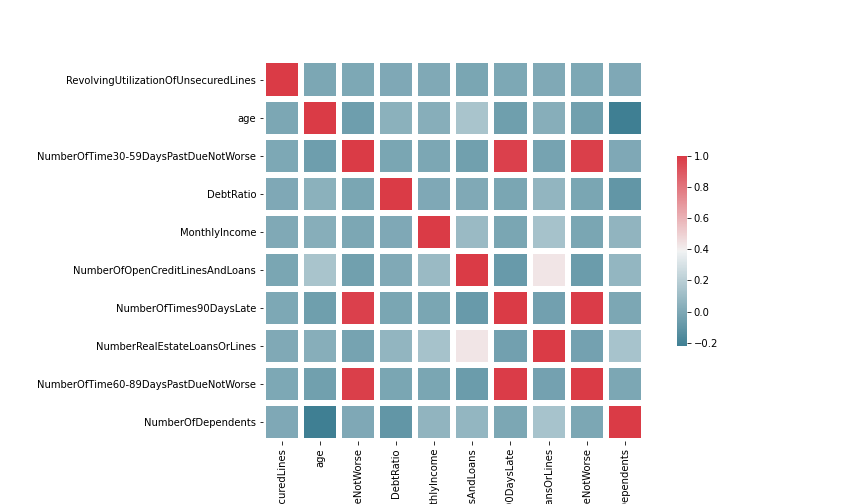

# Predicting financial delinquency
This project predicts whether a person will experience financial distress in the next 2 years based on various factors.
* Created a tool that predicts whether a person will be financially delinquent(AUC=93.7) in the next 2 years.
* Cleaned data by effectively imputing missing values, removing duplicates and removing significant outliers. 
* Optimized Logistic Regression and Random Forest Classifiers by oversampling, removing multicollinearity, scaling, and hyperparameter tuning using GridSearchCV to reach the best model.

## Code and Resources Used

** Packages: pandas, numpy, sklearn, matplotlib, seaborn

** Data from Kaggle: https://www.kaggle.com/c/GiveMeSomeCredit/overview

## Data Cleaning
The first step was to clean the data to make it usable for the model. Here are the steps I took.
* Imputed missing values in columns with the mean values within the values of the highest correlated feature the missing values belong.
  - ex: Replace missing values in the price column with the mean prices within the countries the missing values belong
* Removed significant outliers in the Debt Ratio feature.
* Removed duplicate values.

The notebook is saved as __Data Cleaning.ipynb__

## EDA 
I looked at the distribution and correlations of the data and also made box plots to measure the relationships between different variables and delinquency. 

The notebook is saved as __EDA.ipynb__.

Here below are some highlights from this data analysis. 

## Model Building

I tried two different models Logistic Regression and Random Forest Classifier and evaluated them based on the Area Under the Curve(AUC). 

I used AUC because the classes in the target variable were unbalanced which meant that I could not use accuracy. 

After getting the baseline AUC for both models, I used three strategies to improve the performance of the model.
* 1. Oversampling- I used oversampling to balance the classes because 93% of the data points were in the majority class. However, this caused overfitting so I didn't use this data in the final optimized model.

* 2. Removing multicollinearity- I calculated VIF scores for each feature and analyzed whether to remove or modify any features.

* 3. Scaling- I used Standard Scaler to scale the data. 

After using these strategies, the Logistic Regression model gave the best results so I decided to optimize with GridSearchCV.

The notebook is saved as __Model Building.ipynb__
# Model Results

**AUC** = 93.7%

Finally I used the optimized model to predict the probability of delinquency as well as predict whether the person will be delinquent(1:delinquent, 0:not delinquent) in the next 2 years in the test data.
